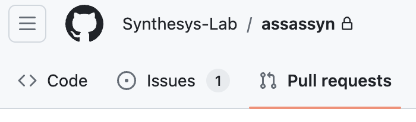
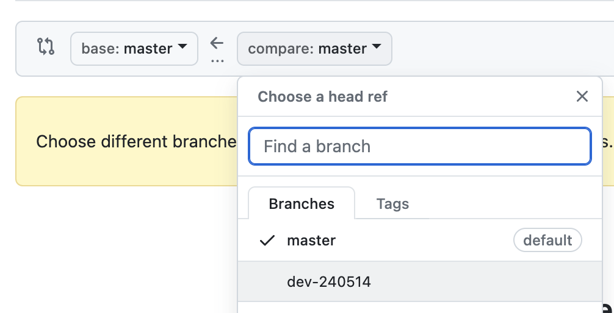
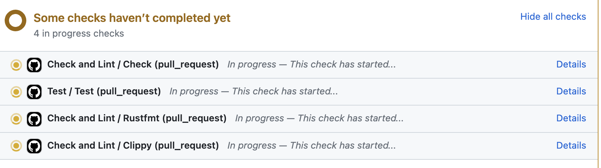

# Developer Doc

## Git & Github Usage

**Formatting:** To ensure consistent code style, copy `assassyn/utils/pre-commit` to your
`.git/hooks/pre-commit`. This setup automatically formats your code and checks coding style with each commit.

If you want to bypass the pre-commit hook during a commit, you can use the command:

````
git commit -m 'your commit message' --no-verify
````

**Adding New Features:**

1. Fork the repository to your account .
2. Clone your fork: `git clone <url-to-your-fork>`.
3. Create a new branch for your changes: `git checkout -b <your-dev-branch>`.
4. After development, submit a pull request to the master branch from your branch.
   - Go to the Pull Request tab in our repo .
   - Find the `New Pull Request` button 
   - Select the base branch as `master` and compare branch as your development branch
     
   - After filling out the PR title and description, click `Create Pull Request` 
   - Wait for all the checks done by the CI/CD pipeline, and the code review from the maintainers. 
   - If everything is good, the maintainers will merge your PR.

**Resolve the conflicts:**

If there is a conflict, resolve it by rebasing the master branch to your development branch.

- `git remote add upstream https://github.com/synthesys-lab/assassyn`
- `git fetch upstream`
- `git rebase upstream/master # Follow the git instructions to resolve conflicts`
- `git push -f origin <your-dev-branch>`


## Git Commit

All the git commits later shall follow this format.
````
[tag] Summarize your changes.
[file-changed-1] Describe the changes.
[file-changed-2] Describe the changes.
Optionally, justify the changes you made.
````

If the change is <=10 lines and 2 files, it is allowed to
just have the 1st line.