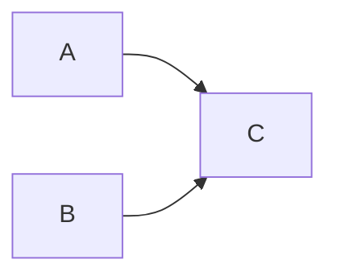

# Language Manual

## Abstract

This document serves as a language manual of Assasyn[^1], a language that unifies hardware design,
implementation, and verification. It is designed to be a relatively high-level language,
so that developers can focus on the behavior of the system, rather than timing, state machine,
and other rules.

## Introduction

Below, is a text representation of our language IR. In the rest of this document, each component
of this example will be explained in both sides, the programming frontend, and the IR representation.
For specific examples, refer to the `tests` directory, which is made to be self-examplatory.

````
// Listing 1: Pseudo-code of the programming paradigms.

system main {
  // Array declarations
  // All the arrays are considered global.
  array: a[int<32>; 1]

  // Implicitly driver is executed every cycle.
  module driver() {
    v = read a[0];
    func = bind = adder { a = v, b = v };
    async_call func();
    new_v = v + 1; // NOTE: This is increase variable "_1" by "one"
    a[0] = v
  }

  module foo(a: int<32>, b: int<32>) {
    c = a + b;
  }
}
````

### Hardware Design

Hardware design is unique to software programming in many ways. Here we characterize several major
differences:

1. Excessive concurrency: Transistors that build different hardware modules can be concurrently
    busy, which is also the source of high performance. However, this also makes the hardware design
    hard to debug. Though we do have parallel programming in software, they are managed in a relatively
    heavy-weighted way, like threads, processes, and tasks. Therefore, a clear way that manages the
    concurrency in a light-weighted way is highly desirable.

2. Data write: In software programming, a variable write is visible to users immediately. However,
    in hardware design, a register variable can only be written once each cycle on the rising edge of a clock, and the written data can only be accessed on subsequent clock cycles.
    In this language, the "write-once" rule will be double-enforced by both the compiler[^2] and the 
    generated simulator runtime.

  ####  Terminology Explanation.

  1. Understanding of "`subsequent cycle`": In hardware design, since register variables are only written on the rising edge of the clock, the data `to be written` must be calculated before the rising edge of the clock, so that the data can be written to the corresponding register variable at the rising edge of the clock. And to access the value just written from the register type variable, it is already the next cycle relative to the clock when the value is calculated. This is the meaning of "next cycle", which means that due to the effect of the register, there is a one-clock-cycle delay between the data calculation and the data read. 
  2. In contrast, combinational type variables (or wire type variables) read the value that is calculated in the same cycle.

3. Resource Constraint: In software programming, different functionalities can share the same
    computing resources through the ISA, while hardware design is to instantiate these
    computing resources. In this language, the time-multiplexed resource sharing,
    and the dedicated allocation should be well abstracted.

## Language & System Components

In this section, each component of the language will be explained in detail, both the frontend programming interfaces, and the IR representations.

The frontend programming interfaces are embedded in Python involving decorators and operator
overloading, which makes the feeling of programming as close to software as possible. The backend
programming interfaces are implemented in Rust, a language with very steep learning curve, so
we decide not to expose this too much to users.

### System

A whole system is comprised by several modules (see above) and arrays.
A system may have a `driver` module (see more details in the next paragraph to explain the module),
which is invoked every cycle to drive the whole system. This "driver" serves like a `main`
function, which is both the program entrance and drives the system execution.

To build a system, `SysBuilder` should be used:

````Python
from assassyn import *
from assassyn.frontend import *

sys = SysBuilder("main")

with sys:
    # Build modules
````

The `SysBuilder` not only serves as the system itself, but also works as an IR builder to grow
the hardware description.

### Module

Module is a basic build block of the system, but it is also slightly different from
the modules we have in both software and hardware programming.

To make an analogy to existing concepts in software programming, a module is like both a function,
and a basic block. Basic block is a very common concept in compiler design, which indicates a
region of code starts with a label which can be the destination of a jump,
ends with a jump operation. This is used to support control flows (if-then-else, loops, etc.).
However, in a physical circuit, no operations can move backward --- you can only have a cyclic
graphs in combinational logics.

NOTE: For simplicity, we currently regard all the operations within a module is combinational,
which means everything is done within one cycle. Our future goal will automatically partition
the pipeline stages to improve the clock frequency.

To describe a module, both `module.constructor` and `module.combinational` macro should be used.
The `module.constructor` decorate the constructor of the module, and the `module.combinational`
decorates the combinational logic of this module. See the example below.

In the constructor, all the ports should be declared. Using the `Port` class. The decorator will
implicitly maintain the additional port information, like the name (identifier) of the port.

In the combinational logic, all the operations are described. The operations involving Assassyn
objects are overloaded. These overloaded operations will transistively build the IR representation.
These IR nodes will be implicitly pushed into the module by the `module.combinational` decorator.

````python
class Adder(Module):
    @module.constructor
    def __init__(self):
        super().__init__()
        self.a = Port(Int(32))
        self.b = Port(Int(32))

    @module.combinational
    def build(self):
        c = self.a + self.b

class Driver(Module):
    @module.constructor
    def __init__(self):
        super().__init__()

    @module.combinational
    def build(self, adder: Adder):
        cnt = RegArray(Int(32), 1)
        v = cnt[0]
        cnt[0] = cnt[0] + 1
        adder.async_called(a=v, b=v)
````

A Driver module is a special module, like a `main` function in software programming, which serves as the entrance of the system. It is unconditionally invoked every cycle to drive the whole system.

Such a described module should be instantiated under the scope of a `SysBuilder`, which is like the top function in RTL programming.

````python
with sys:
    adder = Adder()
    driver = Driver()

    adder.build()
    driver.build(adder)
````

We adopt a design/implementation separated style in our language so that we do not suffer from
cyclic dependences.

The above shows the basic structure of a Module. After explaining the fundamental syntax, we will delve into how to use Modules for hardware programming construction.

<a id = "Module_1"></a>

Click here to [jump](#Module_2)

### Values and Expressions

In each module, we have several operations to describe the behaviors, including arithmetics,
read/write to arrays, and asynchronous module invocations.

#### Overview

This Overview outlines the type classification in the system, specifying that only POD and compound types are permissible as parameters for template-like constructs.

`Int/UInt/Float` are POD.

`Record` is compound.

`Reg`, and `Port` are template-like.

You can only pass POD and compound to the parameter of `template`

#### Body

1. Basic types: Currently, we support `{Int/UInt/Bits}(bit)`, `Float`, and `Record` types.
    * **Record**: A `Record` type allows multiple fields to be bundled together, each field having its own data type and bit width. Records can be defined either by specifying the field bit ranges manually or by field name directly.
        * Use `bundle()` for packing values when fields are continuously aligned.
        * Use `view()` to create a view of non-continuous or even continuous fields from a given value.
        * `Record` is a syntactic sugar that concatens any variable in a fixed order into a larger vector.
2. Values start with ports, arrays, and constants, and can be built by operations among them.
    * Ports are the inputs of a module, which are typically scalars. 
    * In fact, ports are special registers, stage FIFO channels. We can push/pop data to them. Therefore, we cannot give them `RegArray`
    * Arrays are first delared by `RegArray(type, size)`, where `size` should be a constant in the IR.
      * Variables of type `RegArray` are register type variables, which means they can only be written once in a cycle, and the written data can only be accessed in the next cycle.
      * It can be passed as a formal parameter of type `Array`.
    * Constants can be declared by `type(value)`, e.g. `Int(32)(1)`.
3. Expressions
    * Arithmetic operations: `+`, `-`, `*`, `/`, `%`, `**`, `&`, `|`, `^`, `~`, `<<`, `>>`.
    * Comparison operations: `==`, `!=`, `>`, `>=`, `<`, `<=`.
    * Port FIFO methods: `Port.{pop/push/peek/valid}`.
    * Addressing: `array[index]` for both left and right value.
    * Slicing: `array[start:end]` for only right value. Unlike Python, the slicing is inclusive on both.
    * Concatenation: `a.concat(b)`, where `a` is the msb, and `b` is the lsb.
    * Module invocation: `module.async_called(**kwargs)`. Since the ports are declared in the constructor, which are unordered, therefore, we use the named arguments to feed the parameters.
    * Binds: `module.bind(**kwargs)`. This is like function binding in functional programming, where fixes several parameters fed to the module, and returns a handle to this module without invoking it.
4. Scopes and Conditional Execution:
    * We support if-statement (without else) in our combinational logic.

    ```` Python
    with Conditional(cond):
        # do something
    ````

    * NOTE: With Condition(cond) is a compilation-time IR builder API.  If you use `if` statement, it is a runtime API. Refer to the usage in `test_async_call.py` and `test_eager_bind.py`  to differentiate these two.
      * Analogous to the syntax of C
        1. The use of `With Condition(cond)` is analogous to the `if` statement in C language. It indicates that the execution path will be selected based on the condition `cond`. Here, the compiled code is fixed, but the execution path will vary according to the value of `cond`.
        
           ```python
           # Assassyn Code
           with Condition(xxx):
              # do something
           ```
        
           ```c
           // C Code
           if (xxx) {
              // do something
           }
           ```
        
        2. In contrast, the behavior of the `if` statement in this context is more like a macro instruction in the C language. It states that depending on the condition `cond`, the resulting generated code will also differ. In other words, the compiled code itself will vary because of the different values of `cond`.
        
           ```python
           # Assassyn
           if xxx:
              # some embedded assassyn code
           ```
        
           ```c
           // C Code
           #if xxx
           some gaurded code
           #endif
           ```
        
           
        
        > hint: The phrase “compiled code” mentioned here refers to the behavior of syntax in the C language for explanation purposes.
        > 
        > In reality, in this language, the final outcome is a design result of a hardware circuit.
      
    * Besides, we also support cycle-speicific operation to write testbenches.
    
    ```` Python
    with Cycle(1):
        # do something
    with Cycle(2):
        # do something
    ````
    
5. Array Operations: This is a supplimentary description to expression addressing. All the array reads are immediate, while all the array writes are chronological --- the values are only visible next cycle. No two array writes within the same cycle are allowed. The generated simulator will enforce this.

---

## In-Depth Analysis with Code Examples

After reading the basic explanation above, you now have a fundamental understanding of this language paradigm. Let’s proceed with the given example and explain the syntax in more detail step by step

> **Note**: Files that have not been assigned a location are in the  directory "python/ci-tests".

### More basic grammar explanations

You can find the detail information in [python/ci-tests/README.md](../python/ci-tests/README.md)

> By this point, the basic syntax has been fully listed out.


### More On Modules (Code Engineering)

<a id="Module_2"></a>

[jump back](#Module_1)

This is the supplementary content mentioned in the Module section above.

This section combines code in order to explain how to express a combinational logic port module, a timing logic port module, and a more complex mixture of port types, which are the core of how to write a true hardware design rather than just a simple logic operation demo.

#### Pure Sequential Logic Port Module

Ports are connected using `async_called` and `bind` methods.
The reason for using `bind` is that if ports are obtained from multiple modules separately, as shown in the diagram below, where module C's ports are connected from A and B respectively, it is not possible to directly use `async_called`. Using `bind` returns a handle to wait for new port connections. (In fact, `async_called` also returns a handle for operations, see `test_fifo1`)



Read the code and run the results: `test_bind, test_eager_bind, test_imbalance, test_fifo_valid`


Additionally, a simple automatic state machine has been introduced to implement the execution of events/modules after waiting for conditions to be met.

Read the code and run the results: `test_wait_until`

#### Pure Combinational Logic Port Module
First, it is necessary to expose the combinational logic ports.
This is achieved through the use of the `return` statement. (Note: The `return` in the `build` method can return anything, such as a single primitive, a list of multiple primitives, a tuple, etc.)

Read the code and run the results: `test_comb_expose`

Once the combinational logic ports are exposed, the next step is to connect them to the formal parameters of the `build` method in the `downstream` module.

Read the code and run the results: `test_toposort, test_downstream`

It is important to observe the differences between `Module` and `Downstream`, as well as between `combinational port connections` and `sequential port connections`.

> hint: understanding of `downstream`:
>
> 1. The term `downstream` (下游模块) is relative to `upstream` (上游模块) and refers to the existence as a submodule of the upstream module. In this context, `upstream` typically denotes the `Pure Sequential Logic Port Module`, while `downstream` refers to the `Pure Combinational Logic Port Module`.
> 2. The `downstream` module is conceptualized as the component within a design stage that executes the internal combinational logic. Initially, the `upstream` sequential module gathers the required timing signals, which are subsequently transferred to one or more `downstream` combinational modules for additional processing and logical manipulation.

#### Mixed Port Types

In practice, most modules receive both combinational and sequential ports, offering a general approach:

```python
class Fetcher(Module):
    
    def __init__(self):
        super().__init__(ports={}, no_arbiter=True)
        self.name = 'F'

    @module.combinational
    def build(self):
        pc_reg = RegArray(Bits(32), 1)
        addr = pc_reg[0]
        return pc_reg, addr

class FetcherImpl(Downstream):

    def __init__(self):
        super().__init__()
        self.name = 'F1'

    @downstream.combinational
    def build(self,
              on_branch: Value,
              br_sm: Array,
              ex_bypass: Value,
              ex_valid: Value,
              pc_reg: Value,
              pc_addr: Value,
              decoder: Decoder,
              data: str,
              depth_log: int):

 		# …………………… Omitted for brevity ……………………

```

Connect the sequential ports to the `Module` type module of `Fetcher(Module)`, extract their values, and expose them in the manner of combinational ports. These are then received by a `Downstream` type module like `FetcherImpl(Downstream)`, which also receives other combinational ports and processes them uniformly within.


The code above comes from `examples/minor-cpu/src/main.py:262`


#### FSM

Use `with Condition(Cond)` to indicate the behavior corresponding to different states, which can fully simulate the functionality of the `case` statement in Verilog.

For implementing changes in combinational logic under different states using an `assign` statement (instead of `always + case`) in Verilog, you can use the `select` syntax to choose.

```verilog
assign temp = array0 & {3{cond[0]}} |
    	      array1 & {3{cond[1]}} |
              array2 & {3{cond[2]}} |
```

In Assasyn, you can achieve the same using the `select` syntax:

```python
temp = cond.select(array[0], array[1], array[2])
```


[^1]: The name "Assasyn" stands for "**As**ynchronous **S**emantics for **A**rchitectural **S**imulation and **Syn**thesis".

[^2]: I have the ambition to build a formal verification to statically enforce this rule, but for now, we only have a runtime check.
